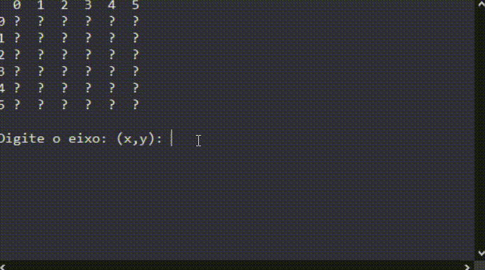

# Jogo Campo Minado em Java e teste com JUnit5

Este projeto consiste na implementação do clássico jogo Campo Minado em Java, utilizando a biblioteca JUnit5 para testes unitários e o sistema de build Maven. A aplicação foi desenvolvida para ser executada no console.

## Como jogar
O objetivo do jogo é encontrar todas as minas em um tabuleiro sem detoná-las. O tabuleiro é composto por uma grade de células que podem ser reveladas uma a uma pelo jogador. Cada célula pode conter uma mina ou um número que indica a quantidade de minas adjacentes a ela.

Para jogar, basta executar a classe Main no console e seguir as instruções apresentadas.

## Testes unitários
Para garantir a qualidade do código, foram implementados testes unitários utilizando a biblioteca JUnit5. Os testes podem ser encontrados na pasta src/test e podem ser executados através da IDE ou utilizando o comando mvn test no terminal.

## Como contribuir
Contribuições são sempre bem-vindas! Se você deseja contribuir para o projeto, basta seguir os seguintes passos:

1. Faça um fork deste repositório
2. Crie um branch para sua feature (git checkout -b minha-feature)
3. Faça as alterações necessárias
4. Commit suas alterações (git commit -m 'Adicionando nova feature')
5. Envie suas alterações para o seu repositório remoto (git push origin minha-feature)
6. Abra um Pull Request
